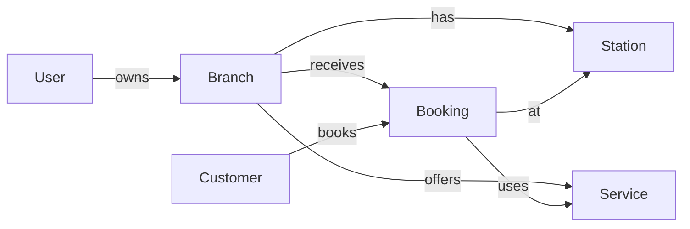

# 🚗 Letwash - Enterprise Car Wash Management Platform

[](https://opensource.org/licenses/MIT)
[](https://nodejs.org/)
[](https://www.postgresql.org/)
[](https://aws.amazon.com/)

> **Production-ready SaaS platform** for multi-location car wash businesses with subscription management, SSO authentication, real-time operations, and comprehensive analytics.

---

## 🌟 Key Features

### 🔐 **Authentication & Authorization**
- ✅ **Role-Based Access Control** (ROOT_OWNER, CARWASH_OWNER, MANAGER, STAFF)
- ✅ **SSO Integration** (Google, Apple, Microsoft via AWS Cognito)
- ✅ **JWT Token Authentication** with refresh token support
- ✅ **Secure Password Hashing** (bcrypt)

### 🏢 **Multi-Module Business Support**
- ✅ **In-Bay Automatic** - Automated wash stations
- ✅ **Tunnel Wash** - Conveyor belt systems
- ✅ **Self-Service** - DIY wash bays
- ✅ **Mobile Wash** - On-site services
- ✅ **Manual Detailing** - Premium hand wash
- ✅ **Mobile Detailing** - Mobile premium services
- ✅ **Pick-up & Drop-off Detailing** - Valet services

### 🚙 **Vehicle Type Filtering**
- Dynamic pricing based on vehicle type (Sedan, SUV, Truck, Electric, Luxury)
- Configurable multipliers per service
- Automatic duration calculation

### 💳 **Subscription System**
- **Starter Plan** - Small businesses (1 location, 3 modules)
- **Professional Plan** - Growing businesses (5 locations, all modules)
- **Enterprise Plan** - Large operations (unlimited)
- Monthly/Yearly billing cycles
- 14-day free trial

### 📊 **Analytics & Insights**
- Real-time dashboard
- Revenue tracking
- Customer analytics
- Service performance metrics
- Peak hours analysis

### 🔔 **Notifications**
- Booking confirmations
- Appointment reminders
- Payment receipts
- Campaign announcements
- System alerts

---

## 🏗️ Tech Stack

### **Frontend**
- **React 18** with TypeScript
- **Tailwind CSS** for styling
- **Lucide React** for icons
- **React Router** for navigation
- **Vite** for fast builds

### **Backend**
- **Node.js 18+** with Express.js
- **PostgreSQL 15+** with Prisma ORM
- **JWT** for authentication
- **Passport.js** for OAuth strategies
- **AWS SDK** for cloud services

### **Infrastructure**
- **AWS RDS** - PostgreSQL database
- **AWS ECS/Fargate** - Backend hosting
- **AWS S3 + CloudFront** - Frontend hosting
- **AWS Cognito** - User authentication
- **Docker** - Containerization

---

## 🚀 Quick Start

### Prerequisites
```bash
node --version  # v18+ required
npm --version   # v9+ required
docker --version  # Latest
```

### 1️⃣ Clone Repository
```bash
git clone https://github.com/Smyrgzr/LWT.git
cd LWT
```

### 2️⃣ Install Dependencies
```bash
# Install frontend dependencies
npm install

# Install backend dependencies
cd backend
npm install
cd ..
```

### 3️⃣ Configure Environment
```bash
# Frontend environment
cp .env.example .env
# Edit .env with your configuration

# Backend environment
cp backend/.env.example backend/.env
# Edit backend/.env with your configuration
```

### 4️⃣ Start with Docker (Recommended)
```bash
# Start all services (frontend, backend, database)
docker-compose up -d

# View logs
docker-compose logs -f

# Stop services
docker-compose down
```

**Access the application:**
- Frontend: http://localhost
- Backend API: http://localhost:5000
- Database: localhost:5432

---

## 📁 Project Structure

```
letwash/
├── src/                          # Frontend source
│   ├── components/               # React components
│   ├── pages/                    # Page components
│   ├── hooks/                    # Custom hooks
│   ├── contexts/                 # React contexts
│   └── utils/                    # Utilities & API client
├── backend/                      # Backend API
│   ├── src/
│   │   ├── controllers/          # Route controllers
│   │   ├── routes/               # API routes
│   │   ├── middleware/           # Custom middleware
│   │   ├── config/               # Configuration
│   │   └── index.js              # Entry point
│   └── prisma/
│       ├── schema.prisma         # Database schema
│       └── seed.js               # Seed data
├── docker-compose.yml            # Local development
├── Dockerfile                    # Frontend Docker
└── README.md                     # This file
```

---

## 🔌 API Documentation

### Base URL
```
Development: http://localhost:5000/api/v1
Production:  https://api.letwash.com/api/v1
```

### Authentication Endpoints
```
POST   /auth/register           # Create account
POST   /auth/login              # Login
POST   /auth/refresh            # Refresh token
GET    /auth/me                 # Current user
POST   /auth/logout             # Logout
```

### SSO Endpoints
```
GET    /sso/google              # Google OAuth
GET    /sso/apple               # Apple OAuth
GET    /sso/microsoft           # Microsoft OAuth
```

### Business Endpoints
```
# Branches
GET    /branches                # List branches
POST   /branches                # Create branch
PUT    /branches/:id            # Update branch
DELETE /branches/:id            # Delete branch

# Services
GET    /services                # List services
POST   /services                # Create service
PUT    /services/:id            # Update service
DELETE /services/:id            # Delete service

# Bookings
GET    /bookings                # List bookings
POST   /bookings                # Create booking
PUT    /bookings/:id            # Update booking
DELETE /bookings/:id            # Cancel booking

# Analytics
GET    /analytics/dashboard     # Dashboard data
GET    /analytics/bookings      # Booking stats
GET    /analytics/revenue       # Revenue stats
```

📖 **Full API Documentation:** [See DEPLOYMENT.md](./DEPLOYMENT.md)

---

## 🗄️ Database Schema

### Core Models
- **Users** - Authentication & authorization
- **Branches** - Business locations
- **Services** - Service offerings with pricing
- **Stations** - Physical wash stations
- **Bookings** - Appointments & reservations
- **Customers** - Customer profiles
- **Campaigns** - Marketing campaigns
- **Subscriptions** - Subscription management
- **Analytics** - Performance metrics

### Relationships


---

## 🧪 Testing

### Run Tests
```bash
# Backend tests
cd backend
npm test

# Frontend tests
npm test

# E2E tests
npm run test:e2e
```

### Manual Testing
```bash
# Start development environment
docker-compose up -d

# Create test user
curl -X POST http://localhost:5000/api/v1/auth/register \
  -H "Content-Type: application/json" \
  -d '{
    "email": "test@letwash.com",
    "password": "Test123!",
    "fullName": "Test User",
    "businessModules": ["IN_BAY"],
    "subscriptionTier": "STARTER"
  }'
```

---

## 🌐 Deployment

### AWS Deployment (Production)

**Full deployment guide:** [AWS_DEPLOYMENT_COMPLETE_GUIDE.md](./AWS_DEPLOYMENT_COMPLETE_GUIDE.md)

#### Quick Deploy Summary:
```bash
# 1. Infrastructure Setup (30 mins)
- Create RDS PostgreSQL
- Create ECR repositories
- Create S3 bucket + CloudFront
- Setup Route 53 DNS

# 2. Backend Deploy (1 hour)
- Build & push Docker image
- Deploy to ECS Fargate
- Configure Load Balancer

# 3. Frontend Deploy (30 mins)
- Build frontend
- Upload to S3
- Invalidate CloudFront cache

# 4. Database Setup (15 mins)
- Run migrations
- Seed initial data

# 5. SSL & DNS (30 mins)
- Configure SSL certificates
- Setup domain routing
```

#### Estimated Monthly Costs:
- **Staging:** ~$70/month
- **Production:** ~$235/month (1000+ users)

---

## 🔐 Security

### Best Practices Implemented
- ✅ JWT tokens with expiration
- ✅ Password hashing (bcrypt)
- ✅ CORS configuration
- ✅ Rate limiting
- ✅ Helmet.js security headers
- ✅ Input validation
- ✅ SQL injection prevention (Prisma)
- ✅ XSS protection

### Environment Variables Security
- Never commit `.env` files
- Use AWS Secrets Manager in production
- Rotate credentials regularly
- Use least-privilege IAM roles

---

## 📊 Monitoring

### AWS CloudWatch
- Application logs
- Error tracking
- Performance metrics
- Custom dashboards

### Recommended Tools
- **Error Tracking:** Sentry
- **APM:** New Relic / DataDog
- **Uptime:** Pingdom / UptimeRobot
- **Analytics:** Google Analytics

---

## 🤝 Contributing

We welcome contributions! Please follow these steps:

1. Fork the repository
2. Create a feature branch (`git checkout -b feature/amazing-feature`)
3. Commit changes (`git commit -m 'Add amazing feature'`)
4. Push to branch (`git push origin feature/amazing-feature`)
5. Open a Pull Request

---

## 📄 License

This project is licensed under the **MIT License** - see the [LICENSE](LICENSE) file for details.

---

## 👥 Team

**Letwash Team** - Building the future of car wash management

- Website: https://letwash.com
- Email: support@letwash.com
- GitHub: https://github.com/letwash-tech

---

## 🙏 Acknowledgments

- Built with [React](https://react.dev/)
- Powered by [Node.js](https://nodejs.org/)
- Database by [PostgreSQL](https://www.postgresql.org/)
- Hosted on [AWS](https://aws.amazon.com/)

---

## 📮 Support

- **Documentation:** [/docs](./docs)
- **Issues:** [GitHub Issues](https://github.com/letwash-tech/letwash/issues)
- **Email:** support@letwash.com
- **Discord:** [Join our community](https://discord.gg/letwash)

---

<div align="center">

**⭐ Star us on GitHub — it motivates us a lot!**

Made with ❤️ by the Letwash Team

[Website](https://letwash.com) • [Documentation](./docs) • [API](./DEPLOYMENT.md) • [Deploy](./AWS_DEPLOYMENT_COMPLETE_GUIDE.md)

</div>