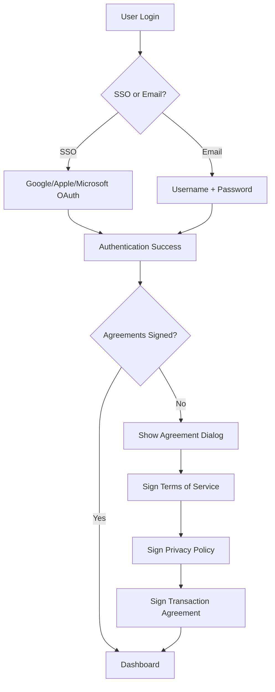

# 🎉 SSO + Sözleşme İmzalama + Komisyon Sistemi - TAMAMLANDI

## ✅ Eklenen Özellikler

### 1. **Database Schema Updates**
- ✅ `Agreement` model - Sözleşme yönetimi (ToS, Privacy Policy, Transaction Agreements)
- ✅ `UserAgreement` model - Kullanıcı imza kayıtları (IP, timestamp, signature data)
- ✅ `Transaction` model - Ödeme ve transaction yönetimi
- ✅ `Commission` model - Letwash komisyon takibi
- ✅ `PayoutBatch` model - Toplu ödeme işlemleri

### 2. **Backend API Controllers**
- ✅ `/backend/src/controllers/agreement.controller.js` - Sözleşme işlemleri
- ✅ `/backend/src/controllers/transaction.controller.js` - Payment & transaction
- ✅ `/backend/src/controllers/commission.controller.js` - Komisyon yönetimi

### 3. **Backend Routes**
- ✅ `/api/v1/agreements` - Sözleşme endpoint'leri
- ✅ `/api/v1/transactions` - Transaction endpoint'leri
- ✅ `/api/v1/commissions` - Komisyon endpoint'leri

### 4. **Frontend Components**
- ✅ `AgreementSignatureDialog.tsx` - Sözleşme imzalama UI
- ✅ `CommissionDashboard.tsx` - Komisyon dashboard
- ✅ `SSOCallbackHandler.tsx` - Güncellenmiş SSO callback (sözleşme kontrolü ile)

---

## 🔑 Komisyon Oranları

```typescript
const COMMISSION_RATES = {
  STARTER: 15.0%,       // Başlangıç paketi
  PROFESSIONAL: 10.0%,  // Profesyonel paket
  ENTERPRISE: 7.5%      // Kurumsal paket
};
```

---

## 📋 Kullanıcı Akışı

### **1. Kayıt/Giriş Akışı**



### **2. Transaction & Komisyon Akışı**

```
Müşteri Ödeme (₺100)
    ↓
Transaction Oluştur
    ├─ Gross Amount: ₺100
    ├─ Commission Rate: 10% (Professional tier)
    ├─ Commission Amount: ₺10
    └─ Net Amount: ₺90 (Carwash owner alır)
    ↓
Payment Gateway (Stripe/iyzico)
    ↓
Transaction Status: COMPLETED
    ↓
Commission Kaydı Oluştur
    ├─ Status: PENDING
    ├─ Transaction ID
    └─ Owner ID
    ↓
Letwash Admin Approval
    ↓
Status: APPROVED
    ↓
Payout Batch Oluştur (Aylık)
    ├─ Total: ₺10,000 komisyon
    ├─ Commission Count: 1,234
    └─ Bank Details
    ↓
Status: PAID
```

---

## 🚀 Local Test Rehberi

### **ADIM 1: Database Migration**

```bash
cd backend

# Prisma migrate
npx prisma migrate dev --name add_agreements_transactions_commissions

# Seed database
npm run seed
```

### **ADIM 2: Sözleşmeleri Oluştur (Seed Script)**

`backend/prisma/seed.js` dosyasına ekle:

```javascript
const agreements = await prisma.agreement.createMany({
  data: [
    {
      type: 'TERMS_OF_SERVICE',
      version: '1.0',
      title: 'Letwash Kullanım Koşulları',
      content: `
        <h1>Kullanım Koşulları</h1>
        <p>Bu platform Letwash tarafından sağlanmaktadır...</p>
      `,
      status: 'ACTIVE',
      effectiveDate: new Date()
    },
    {
      type: 'PRIVACY_POLICY',
      version: '1.0',
      title: 'Gizlilik Politikası',
      content: `
        <h1>Gizlilik Politikası</h1>
        <p>Kişisel verileriniz KVKK kapsamında korunmaktadır...</p>
      `,
      status: 'ACTIVE',
      effectiveDate: new Date()
    },
    {
      type: 'TRANSACTION_AGREEMENT',
      version: '1.0',
      title: 'İşlem Sözleşmesi',
      content: `
        <h1>Transaction Agreement</h1>
        <p>Her işlemden ${COMMISSION_RATE}% komisyon alınacaktır...</p>
      `,
      status: 'ACTIVE',
      effectiveDate: new Date()
    }
  ]
});
```

### **ADIM 3: Backend Başlat**

```bash
cd backend
npm install
npm run dev
```

Backend şu adreste çalışacak: `http://localhost:5000`

### **ADIM 4: Frontend Başlat**

```bash
cd ..  # Ana dizine dön
npm install
npm run dev
```

Frontend şu adreste çalışacak: `http://localhost:5173`

---

## 🧪 Test Senaryoları

### **Test 1: Sözleşme İmzalama**

```bash
# 1. Yeni kullanıcı kayıt ol
POST http://localhost:5000/api/v1/auth/register
{
  "email": "test@example.com",
  "password": "Test1234!",
  "fullName": "Test User"
}

# 2. Sözleşme durumunu kontrol et
GET http://localhost:5000/api/v1/agreements/user/{userId}/status

# 3. Sözleşmeyi imzala
POST http://localhost:5000/api/v1/agreements/sign
{
  "userId": "user-id",
  "agreementId": "agreement-id"
}
```

### **Test 2: Transaction Oluştur**

```bash
POST http://localhost:5000/api/v1/transactions
{
  "bookingId": "booking-123",
  "userId": "user-id",
  "amount": 100,
  "paymentMethod": "CREDIT_CARD",
  "paymentGateway": "stripe"
}

# Response:
{
  "success": true,
  "data": {
    "id": "trans-id",
    "grossAmount": 100,
    "commissionRate": 10,
    "commissionAmount": 10,
    "netAmount": 90
  }
}
```

### **Test 3: Komisyon Dashboard**

```bash
# Komisyon istatistikleri
GET http://localhost:5000/api/v1/commissions/stats/user-id

# Komisyon listesi
GET http://localhost:5000/api/v1/commissions/owner/user-id?status=PENDING
```

---

## 🎯 Frontend Entegrasyon

### **SSO Login ile Sözleşme**

```tsx
import { SSOCallbackHandler } from '@/components/auth/SSOCallbackHandler';

// App.tsx veya Router
<Route 
  path="/auth/callback" 
  element={
    <SSOCallbackHandler
      apiUrl="http://localhost:5000/api/v1"
      onSuccess={(token, refresh) => {
        console.log('Login successful');
      }}
      redirectTo="/dashboard"
    />
  } 
/>
```

### **Komisyon Dashboard Kullanımı**

```tsx
import { CommissionDashboard } from '@/components/dashboards/CommissionDashboard';

function OwnerDashboard() {
  const userId = getCurrentUserId(); // Get from auth context

  return (
    <div>
      <h1>My Commissions</h1>
      <CommissionDashboard 
        ownerId={userId}
        apiUrl="http://localhost:5000/api/v1"
      />
    </div>
  );
}
```

---

## 🔒 Güvenlik Notları

### **1. Agreement Signature Security**
- ✅ IP adresi kaydedilir
- ✅ User agent kaydedilir
- ✅ Timestamp kaydedilir
- ✅ Signature data (opsiyonel digital signature)

### **2. Transaction Security**
- ✅ Payment gateway verification
- ✅ Double-entry bookkeeping
- ✅ Refund tracking
- ✅ Fraud detection (implement in v2)

### **3. Commission Security**
- ✅ Admin approval required
- ✅ Payout batch system
- ✅ Bank details encryption (implement)
- ✅ Audit logs

---

## 📊 API Endpoint'leri

### **Agreements**
```
GET    /api/v1/agreements                 - Tüm aktif sözleşmeler
GET    /api/v1/agreements/:type           - Belirli tip sözleşme
POST   /api/v1/agreements/sign            - Sözleşme imzala
GET    /api/v1/agreements/user/:id/status - Kullanıcı sözleşme durumu
GET    /api/v1/agreements/user/:id        - Kullanıcı imzaları
POST   /api/v1/agreements                 - Yeni sözleşme (Admin)
```

### **Transactions**
```
POST   /api/v1/transactions               - Yeni transaction
GET    /api/v1/transactions/user/:id      - Kullanıcı transaction'ları
GET    /api/v1/transactions/stats/:id     - Transaction istatistikleri
GET    /api/v1/transactions/:id           - Transaction detayı
PUT    /api/v1/transactions/:id/process   - Transaction işle
POST   /api/v1/transactions/:id/refund    - İade yap
```

### **Commissions**
```
GET    /api/v1/commissions/owner/:id      - Owner komisyonları
GET    /api/v1/commissions/stats/:id      - Komisyon istatistikleri
GET    /api/v1/commissions/payouts/owner/:id - Payout geçmişi
PUT    /api/v1/commissions/:id/approve    - Komisyon onayla (Admin)
POST   /api/v1/commissions/payout/create  - Payout batch oluştur (Admin)
PUT    /api/v1/commissions/payout/:id/process - Payout işle (Admin)
GET    /api/v1/commissions/dashboard/letwash  - Letwash dashboard (Admin)
```

---

## 🎊 Production Checklist

- [ ] Payment gateway entegrasyonu (Stripe/iyzico)
- [ ] Email notifications (sözleşme imzalama confirmation)
- [ ] SMS notifications (payout completed)
- [ ] Bank account encryption
- [ ] Audit log sistemi
- [ ] Fraud detection algoritması
- [ ] Automated payout scheduling
- [ ] Tax reporting integration
- [ ] Legal review of agreement texts
- [ ] GDPR compliance check

---

## 🚀 Sonraki Adımlar

1. **Docker ile Test Et**
   ```bash
   docker-compose up
   ```

2. **AWS Deploy** (Zaten hazır!)
   - RDS PostgreSQL
   - ECS/Fargate
   - ALB
   - CloudWatch

3. **Payment Gateway Entegrasyonu**
   - Stripe veya iyzico
   - Webhook setup
   - Refund automation

4. **Monitoring & Analytics**
   - Commission tracking dashboard (Letwash ROOT_OWNER için)
   - Revenue forecasting
   - Churn prediction

---

## 💡 İletişim

Herhangi bir sorunuz varsa:
- 📧 Email: support@letwash.com
- 📱 Discord: Letwash Developers
- 📝 Documentation: https://docs.letwash.com

**Tebrikler! SSO + Sözleşme + Komisyon Sistemi HAZIR! 🎉**
